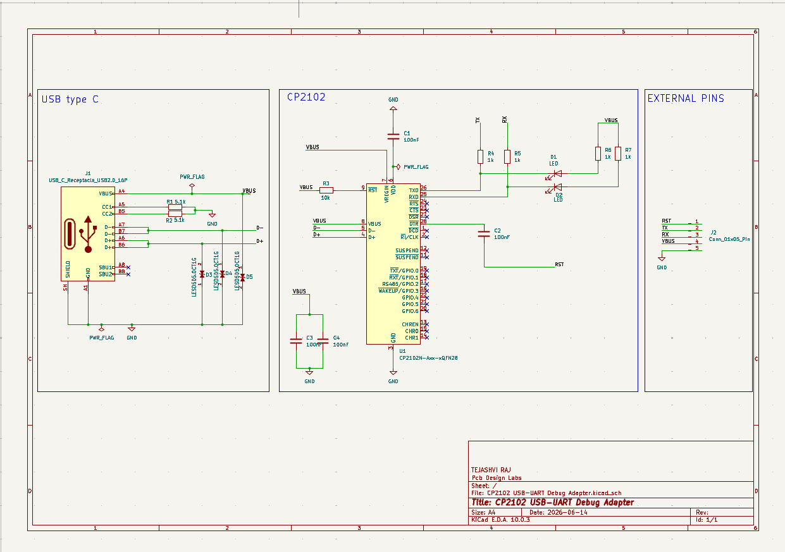
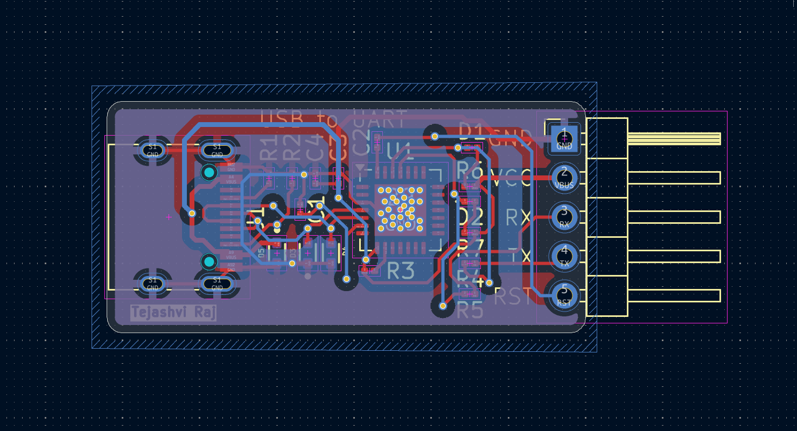
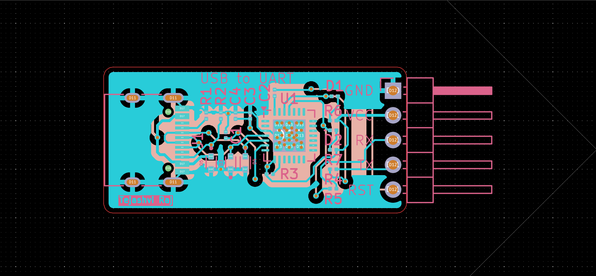
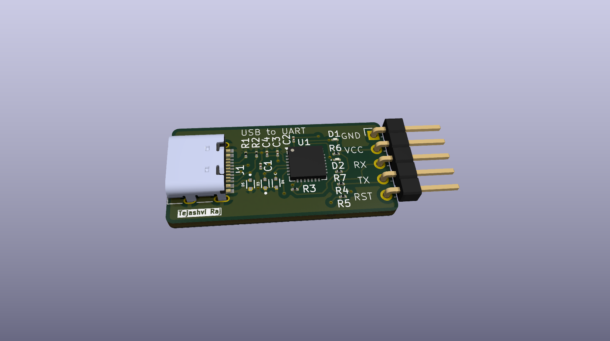

# CP2102 USB-UART Debug Adapter

A compact USB Type-C to UART converter based on the **CP2102 USB-to-UART Bridge Controller**, designed for programming, debugging, and serial communication with embedded systems such as ESP32, STM32, Arduino, and other UART-enabled microcontrollers.

---

## 📌 Features

- USB Type-C interface
- CP2102 USB-to-UART bridge
- TX/RX status indication LEDs
- Reset (RST) output
- ESD protection on USB data lines
- Standard 5-pin UART header
- Compact PCB layout for embedded development

---

## 🛠 Components Used

- CP2102 USB-UART Bridge IC
- USB Type-C Receptacle
- TX/RX LEDs
- ESD Protection Diodes
- 100 nF Decoupling Capacitors
- USB Configuration Resistors
- 5-Pin UART Header

---

## 🔧 Design Workflow

- Schematic Capture using KiCad
- Footprint Assignment
- PCB Component Placement
- Signal Routing
- Design Rule Check (DRC)
- Gerber File Generation
- 3D PCB Verification

---

## 📷 Schematic



---

## 📷 PCB Layout



---

## 📷 Gerber Preview



---

## 📷 3D View



---

## 📂 Project Files

### KiCad Files

Located in:

```text
KiCad_files/
```

Contains:

- CP2102 USB-UART Debug Adapter.kicad_pro
- CP2102 USB-UART Debug Adapter.kicad_sch
- CP2102 USB-UART Debug Adapter.kicad_pcb

---

### Gerber Files

Located in:

```text
Gerber_Files/
```

Contains the manufacturing-ready Gerber package for PCB fabrication.

---

## 🎯 Applications

- ESP32 Programming
- STM32 Programming
- UART Debugging
- Serial Console Interface
- Embedded System Development
- Microcontroller Communication

---

## 🧑‍💻 Author

**Tejashvi Raj**

GitHub: https://github.com/tejashviraj19

---

⭐ If you found this project useful, consider starring the repository.
