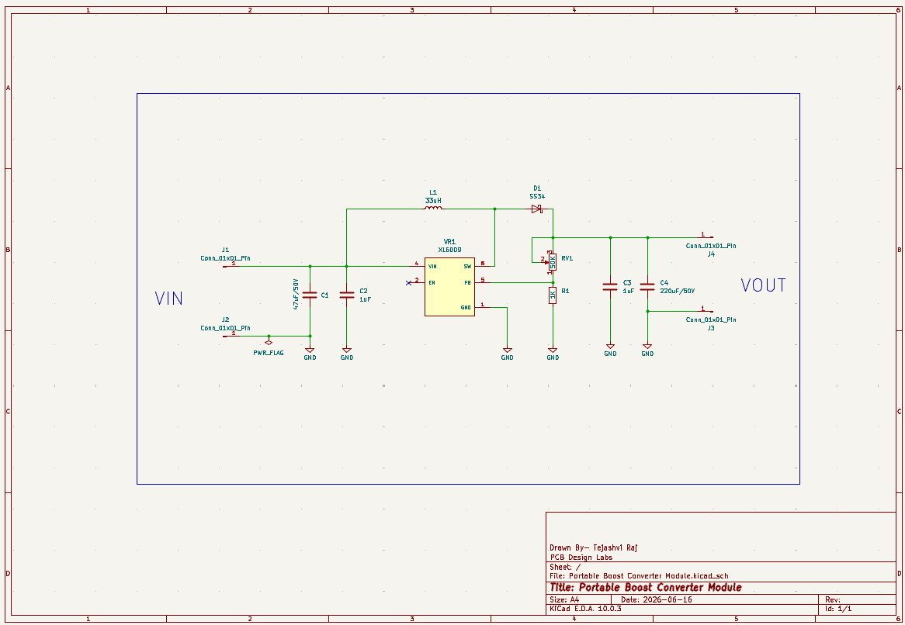
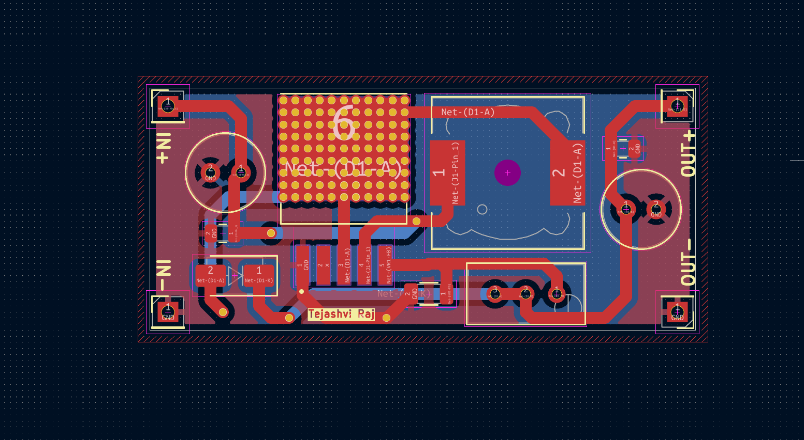
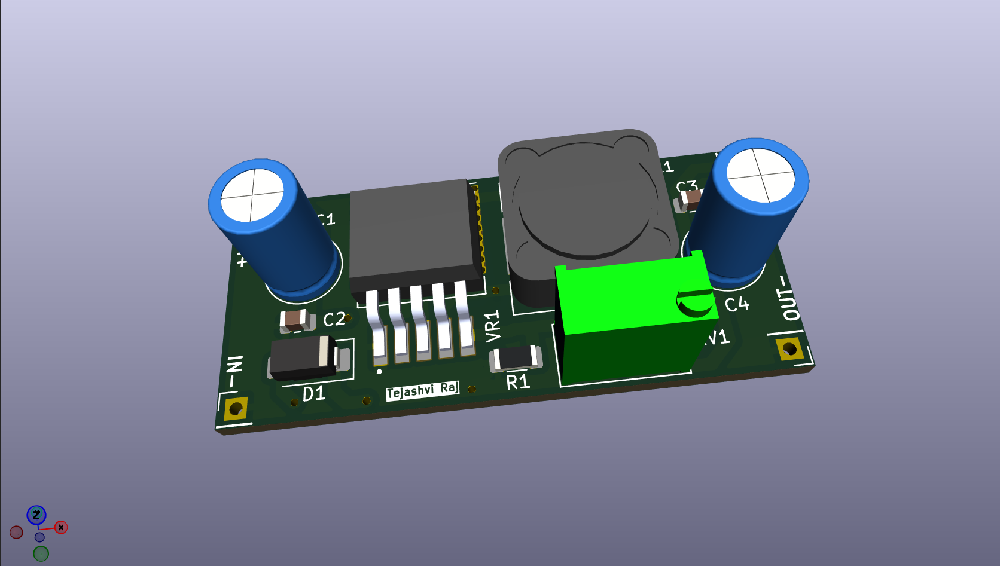
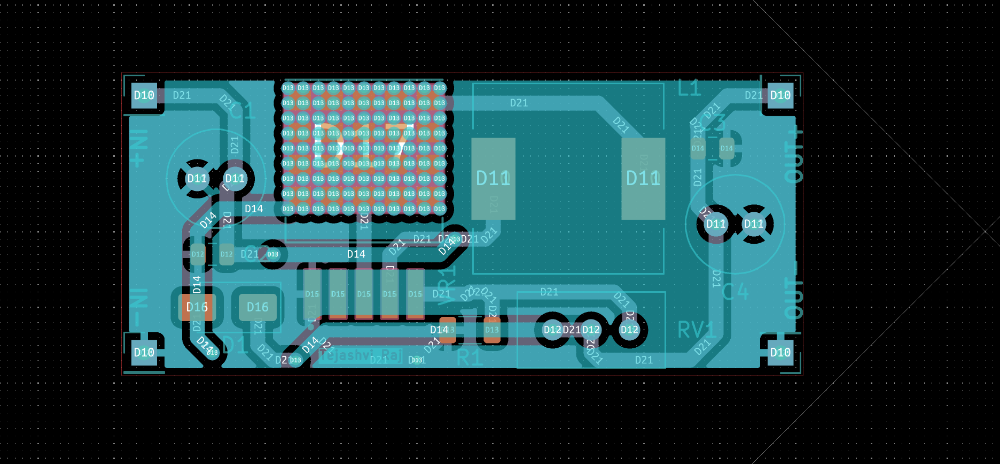

# ⚡ Portable Boost Converter Module

A compact DC-DC boost converter PCB designed using **KiCad**.

This project demonstrates the complete PCB design workflow including schematic capture, PCB layout, routing, Gerber generation, and 3D visualization.

---

## 📌 Project Overview

The Portable Boost Converter Module uses:

- DC-DC Boost Converter IC
- Inductor
- Schottky Diode
- Input & Output Capacitors
- Adjustable Feedback Network
- Screw Terminal Connectors

The PCB is designed as a compact power module suitable for embedded systems, portable electronics, and hardware development projects.

---

## ✨ Features

✅ Compact PCB Design

✅ Efficient Voltage Step-Up Circuit

✅ Adjustable Output Voltage

✅ Screw Terminal Connectivity

✅ Complete KiCad Design Files Included

✅ Gerber Files Ready for Fabrication

---

# 📷 Schematic

---

# 📷 PCB Layout

---

# 📷 3D PCB View

---

# 📷 Gerber Preview

---

## 🔧 Components Used

| Component | Description |
|------------|-------------|
| Boost Converter IC | DC-DC Voltage Booster |
| Inductor | Energy Storage |
| Schottky Diode | Fast Switching Diode |
| Capacitors | Input & Output Filtering |
| Resistors | Voltage Feedback Network |
| Screw Terminals | Input / Output Connections |

---

## 📂 Project Files

### 📁 KiCad Design Files

Open Here:

[KiCad_files](./KiCad_files)

Contains:

- Portable Boost Converter Module.kicad_pro
- Portable Boost Converter Module.kicad_sch
- Portable Boost Converter Module.kicad_pcb

---

### 📦 Gerber Files

Open Here:

[Gerber_files](./Gerber_files)

Fabrication package:

- Gerber.zip

---

## 🛠 Tools Used

- KiCad
- PCB Design
- PCB Routing
- Gerber Generation
- Embedded Hardware Design

---

## 👨‍💻 Author

**Tejashvi Raj**
