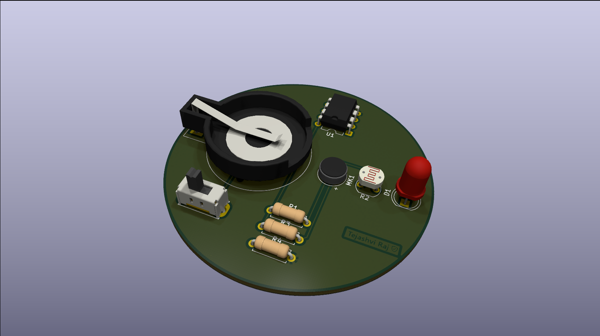

# PCB Design Lab

Collection of PCB Design projects and hardware experiments created using **KiCad**. This repository contains schematic designs, PCB layouts, 3D visualizations, fabrication-ready Gerber files, and complete project resources for various embedded hardware applications.

---

# 📷 Project Gallery

<table>
<tr>

<td align="center">
<a href="./ATtiny85-Smart-Diya">
  
<b>ATtiny85 Smart Diya</b>
</a>
</td>

<td align="center">
<a href="./CP2102 USB-UART Debug Adapter">
  
<b>CP2102 USB-UART Debug Adapter</b>
</a>
</td>

</tr>

<tr>

<td align="center">
<a href="./Portable Boost Converter Module">
  
<b>Portable Boost Converter Module</b>
</a>
</td>

<td align="center">
<a href="./STM32 GPS Tracking Module">
  
<b>STM32 GPS Tracking Module</b>
</a>
</td>

</tr>
</table>

---

# 📂 Projects

| Project | Description |
|----------|-------------|
| **[ATtiny85 Smart Diya](./ATtiny85-Smart-Diya)** | Sound and light reactive PCB using the ATtiny85 microcontroller. |
| **[CP2102 USB-UART Debug Adapter](./CP2102%20USB-UART%20Debug%20Adapter)** | Compact USB-to-UART adapter for serial communication and embedded system debugging. |
| **[Portable Boost Converter Module](./Portable%20Boost%20Converter%20Module)** | Adjustable DC-DC boost converter PCB for portable power applications. |
| **[STM32 GPS Tracking Module](./STM32%20GPS%20Tracking%20Module)** | 4-layer STM32-based GSM & GPS tracking module with complete KiCad source files and fabrication-ready Gerbers. |

---

# 🛠 Tools & Technologies

- KiCad
- PCB Design
- PCB Routing
- Schematic Capture
- Gerber Generation
- 3D PCB Visualization
- Embedded Hardware Design

---

# 📦 Repository Includes

- 📄 Schematics
- 📐 PCB Layouts
- 🎨 3D PCB Models
- 📦 Gerber Files
- 🗂 KiCad Source Files
- 📝 Project Documentation

---

# 📊 Repository Stats

- ✅ 4 PCB Design Projects
- ✅ Complete KiCad Source Files
- ✅ Fabrication-Ready Gerbers
- ✅ 3D PCB Models
- ✅ Project Documentation

---

## 👨‍💻 Author

**Tejashvi Raj**

