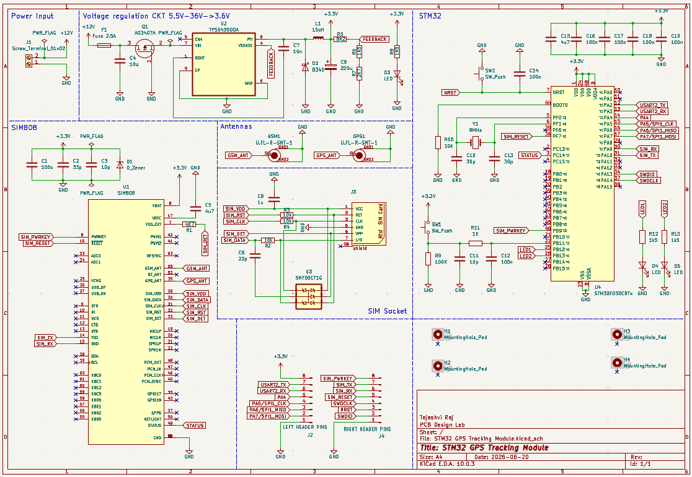
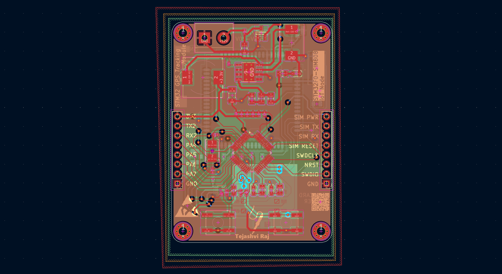
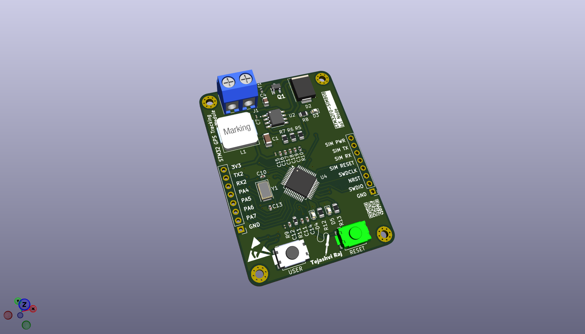
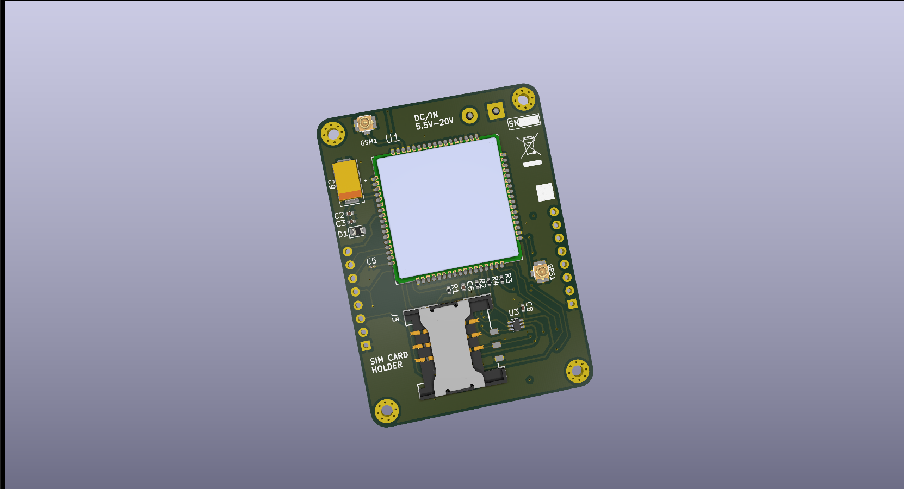
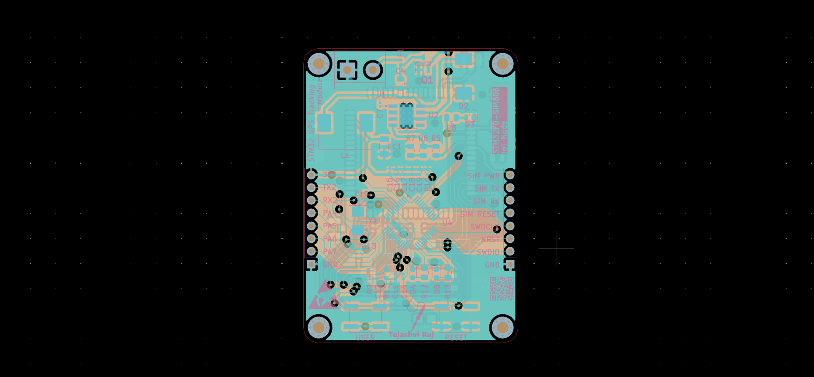

# 📡 STM32 GPS Tracking Module

A compact STM32-based GPS Tracking Module designed using **KiCad**.

This project demonstrates the complete PCB design workflow including schematic capture, PCB layout, multilayer routing, Gerber generation, and 3D visualization.

---

## 📌 Project Overview

The STM32 GPS Tracking Module uses:

- STM32F030C8T6 Microcontroller
- SIM800 GSM Module
- SIM Card Holder
- TPS5430 Buck Converter
- GPS Interface
- GSM & GPS U.FL Connectors
- Crystal Oscillator
- User & Reset Buttons
- SWD Programming Header

The PCB is designed as a compact embedded hardware module suitable for GPS tracking, IoT, GSM communication, and embedded system development.

---

## ✨ Features

✅ 4-Layer PCB Design

✅ STM32-Based Controller

✅ SIM800 GSM Connectivity

✅ GPS Interface

✅ Switching Buck Converter Power Supply

✅ SWD Programming Support

✅ Complete KiCad Design Files Included

✅ Gerber Files Ready for Fabrication

---

# 📷 Schematic

---

# 📷 PCB Layout

---

# 📷 3D PCB View (Front)

---

# 📷 3D PCB View (Back)

---

# 📷 Gerber Preview

---

## 🔧 Components Used

| Component | Description |
|------------|-------------|
| STM32F030C8T6 | ARM Cortex-M0 Microcontroller |
| SIM800 GSM Module | GSM/GPRS Communication |
| TPS5430 | Buck Converter |
| SIM Card Holder | SIM Interface |
| Crystal Oscillator | System Clock |
| U.FL Connectors | GSM & GPS Antennas |
| Buck Converter Components | Power Regulation |
| User & Reset Buttons | User Interface |
| Headers | SWD Programming & GPIO Expansion |

---

## 📂 Project Files

### 📁 KiCad Design Files

Open Here:

[KiCad](./KiCad)

Contains:

- STM32 GPS Tracking Module.kicad_pro
- STM32 GPS Tracking Module.kicad_sch
- STM32 GPS Tracking Module.kicad_pcb

---

### 📦 Gerber Files

Open Here:

[Gerber_File](./Gerber_File)

Fabrication package:

- Gerber.zip

---

## 🛠 Tools Used

- KiCad
- PCB Design
- PCB Routing
- Gerber Generation
- Embedded Hardware Design

---

## 👨‍💻 Author

**Tejashvi Raj**
